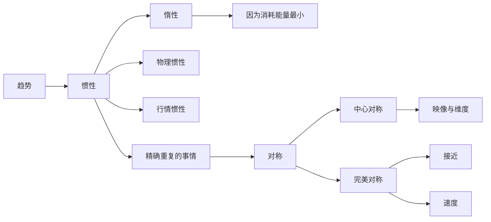
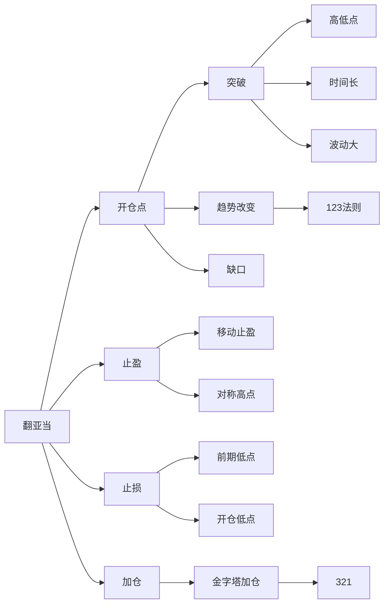

# 心法
1. 从事交易你不需要了解太多，比你看到的还要少
2. 在市场中成功，我们必须投降
3. 对有些事要视而不见，价格包含一切，包含供给与需求
4. 避免武断方法：设每日止损，移动止盈
5. 优秀的交易者会利用方法和持续期，而非转折点
6. 如果一个标的一直跌，我会卖到它跌到0为止；如果一个标的一直涨，我会买到它涨到月球为止
7. 我们关于市场的所有知识，最终会成为你成功的绊脚石

---

## 翻亚当

---------

# 交易守则
1. 亏损头寸绝不加码或摊平
2. 建仓或加码都必须设止损
3. 除非是交易朝着期望的方向，否则绝对不要取消或移动止损点
4. 绝对不要让合理的小亏损变成大亏损，情况不对，立即出场
5. 任何一笔或一天的交易，绝对不能让自己亏损10%以上（2%）
6. 别去抓顶和底，让他们自己抓自己
7. 别挡在列车前面，如果市场往某个方向爆炸性发展，千万别做逆市交易，除非有明确的证据表明已经反转，而不是将要反转
8. 你一定会出错，这是概率决定的，不要怕出错
9. 交易不顺时，可以退场度假休息，让头脑清醒
10. 问问自己是否真想赚钱，然后仔细听自己内心的答案

