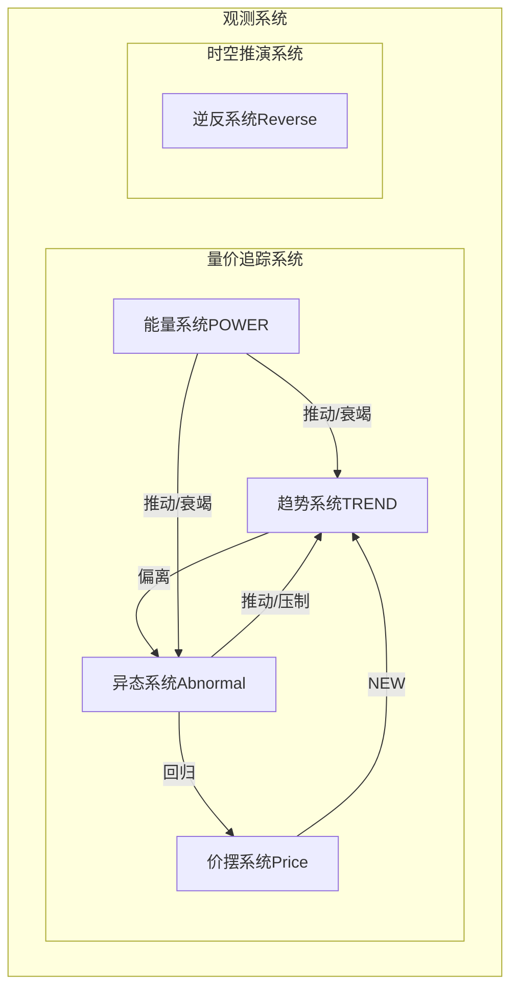

```mermaid
graph 
subgraph 观测系统
subgraph 量价追踪系统
  能量系统POWER --推动/衰竭--> 趋势系统TREND
  趋势系统TREND --偏离--> 异态系统Abnormal
  能量系统POWER --推动/衰竭--> 异态系统Abnormal
  异态系统Abnormal --推动/压制--> 趋势系统TREND
  异态系统Abnormal --回归--> 价摆系统Price
  价摆系统Price --NEW--> 趋势系统TREND
end
subgraph 时空推演系统
    逆反系统Reverse
end
end
```

-------

能量系统是原始动能
价摆系统是最终表现
靠趋势系统赚钱
靠异态系统避险
靠时空系统推演

时空系统：形态，筹码分布，