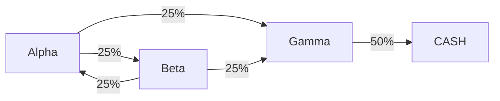

1. `Alpha` 高风险高回报，负责资产的质变
2. `Beta` 中风险中回报，负责资产的量变
3. `Gamma` 低风险低回报，负责稳定的收入
4. `CASH` 现金池，负责日常消费所需
5. 按时平衡各账户的资产分配比例，`Alpha:Beta:Gamma = 1:2:2`
6. 可以开设 `Gamma` 子账户，比如 `Gamma:House` 用于购房所需资产
7. 可以开设 `CASH` 子账户，比如 `CASH:House:Loan` 用于还房贷